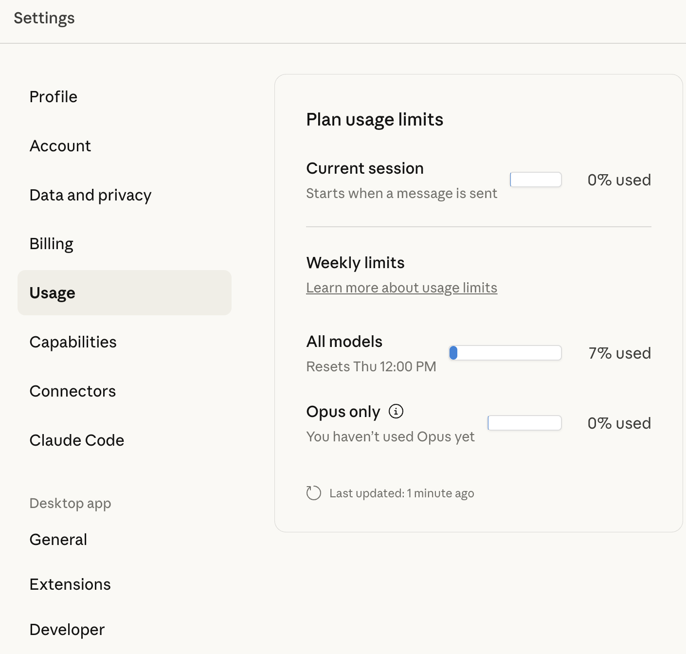

# Claude Code Custom Status Line

[](LICENSE)
[](https://github.com/howie/claude-code-omystatusline/stargazers)
[](https://github.com/howie/claude-code-omystatusline/network)
[](https://goreportcard.com/report/github.com/howie/claude-code-omystatusline)
[](https://github.com/howie/claude-code-omystatusline/releases)
[](go.mod)
[](https://github.com/howie/claude-code-omystatusline/actions/workflows/ci.yml)
[](https://github.com/howie/claude-code-omystatusline/commits/main)

> A rich, context-aware status line for Claude Code that keeps you informed about what really matters.

[English](#english) | [中文](#chinese)

---

<a name="english"></a>

## Why This Exists

When working with Claude Code, you're often juggling multiple concerns simultaneously:

- **"Which branch am I working on?"** - Especially critical when using git worktrees across multiple terminal sessions
- **"How much context have I consumed?"** - Token usage directly impacts response quality and cost
- **"How long have I been in this session?"** - Time tracking helps manage workflow and billing awareness

The default Claude Code interface doesn't surface this critical information. You find yourself constantly running `git branch`, checking token counts in responses, and losing track of time across multiple sessions.

**This status line solves that by bringing all essential information to every interaction.**

## Inspiration

This project was inspired by the powerful status lines in tools like:
- **Vim/Neovim** - Where the status line shows mode, file info, cursor position, and git status at a glance
- **tmux/zsh prompt** - Rich terminal status lines that display git branches, execution time, and context
- **IDE status bars** - Like VS Code's integrated git status, branch info, and diagnostic counts

The idea: *If these tools can show relevant context in every view, why can't Claude Code?*

## What Makes This Special

### 🎯 Git Intelligence
- **Branch awareness** with `⚡ main` indicator
- **Worktree detection** with `🔀` icon - crucial for parallel development
- **Smart caching** - Git operations cached for 5 seconds to avoid performance hits

**Why it matters**: When working across multiple worktrees (e.g., `feature-a` in one terminal, `hotfix` in another), you always know which branch Claude is modifying.

### 📊 Token Consumption Tracking
- **Real-time usage display**: `██████░░░░ 65% 130k`
- **Visual progress bar** showing proximity to 200k token limit
- **Color-coded warnings**:
  - 🟢 Green (< 60%): Plenty of context remaining
  - 🟡 Gold (60-80%): Moderate usage
  - 🔴 Red (≥ 80%): Approaching limit, consider starting fresh session

**Why it matters**: Token exhaustion leads to degraded responses. This visual indicator lets you proactively manage context before quality drops.

### ⏱️ Session Time Tracking
- **Accumulated time**: `2h45m` across all activities today
- **Multi-session awareness**: `[3 sessions]` when running multiple Claude instances
- **Intelligent interval tracking**: Gaps over 10 minutes create new time intervals

**Why it matters**: Helps you understand actual usage patterns, manage billing expectations, and maintain healthy work sessions.

### 🎨 At-a-Glance Context
Every status line shows:
```
[💠 Sonnet 4.5] 📂 my-project ⚡ main | ██████░░░░ 65% 130k | 2h45m [2 sessions]
｜Your last message appears here for context...
```

**Model badge** → **Project** → **Git branch** → **Token usage** → **Time tracking** → **Your message**

All the information you need, updated with every interaction.

## Features

- ✅ **Model Display**: Shows current Claude model (Opus 💛, Sonnet 💠, Haiku 🌸)
- ✅ **Project Info**: Current directory name for orientation
- ✅ **Git Integration**: Branch, worktree detection, smart caching
- ✅ **Context Tracking**: Visual progress bar, percentage, formatted token count
- ✅ **Session Time**: Daily accumulated time, multi-session detection
- ✅ **User Message**: Last message displayed for quick context recall
- ✅ **Performance**: Concurrent goroutines for sub-100ms status updates

## Installation

### Quick Install (Recommended)

```bash
make install
```

Then add to your `~/.claude/config.json`:
```json
{
  "statusLineCommand": "~/.claude/statusline-wrapper.sh"
}
```

### Manual Installation

See [Installation Guide](docs/installation.md) for detailed instructions.

## How It Works

The status line receives JSON from Claude Code containing session metadata and outputs a formatted ANSI-colored string. Key optimizations:

- **Parallel processing**: Git, context, and time data fetched concurrently
- **Smart caching**: Git branch cached to reduce overhead
- **Efficient parsing**: Only reads last 100-200 lines of transcript for context analysis
- **Minimal I/O**: Fast file operations with structured JSON parsing

## Requirements

- Go 1.16+ (for recommended implementation)
- Git
- Claude Code CLI
- Terminal with ANSI color support

## Contributing

Contributions welcome! This tool is built for the community by the community.

## License

Apache License 2.0 - customize freely!

---

<a name="chinese"></a>

## 為什麼需要這個工具

在使用 Claude Code 時，你經常需要同時關注多件事：

- **「我現在在哪個分支上工作？」** - 尤其在使用 git worktree 跨多個終端機時特別重要
- **「我已經消耗了多少 context？」** - Token 使用量直接影響回應品質和成本
- **「我在這個 session 裡工作多久了？」** - 時間追蹤有助於管理工作流程和計費意識

預設的 Claude Code 介面並不會顯示這些關鍵資訊。你會發現自己不斷地執行 `git branch`、檢查回應中的 token 數量，並在多個 session 中失去時間感。

**這個狀態列透過在每次互動中呈現所有必要資訊來解決這個問題。**

## 靈感來源

這個專案的靈感來自於以下工具強大的狀態列：
- **Vim/Neovim** - 狀態列顯示模式、檔案資訊、游標位置和 git 狀態
- **tmux/zsh prompt** - 豐富的終端機狀態列，顯示 git 分支、執行時間和上下文
- **IDE 狀態列** - 如 VS Code 整合的 git 狀態、分支資訊和診斷計數

核心理念：*如果這些工具都能在每個視圖中顯示相關的上下文，為什麼 Claude Code 不行？*

## 特色功能

### 🎯 Git 智慧感知
- **分支感知**，顯示 `⚡ main` 指示器
- **Worktree 偵測**，使用 `🔀` 圖示 - 對平行開發至關重要
- **智慧快取** - Git 操作快取 5 秒以避免效能衝擊

**為什麼重要**：當你在多個 worktree 間工作時（例如一個終端機在 `feature-a`，另一個在 `hotfix`），你永遠知道 Claude 正在修改哪個分支。

### 📊 Token 消耗追蹤
- **即時使用量顯示**：`██████░░░░ 65% 130k`
- **視覺化進度條**，顯示接近 200k token 限制的程度
- **顏色編碼警告**：
  - 🟢 綠色（< 60%）：剩餘大量 context
  - 🟡 金色（60-80%）：中度使用
  - 🔴 紅色（≥ 80%）：接近限制，考慮開始新 session

**為什麼重要**：Token 耗盡會導致回應品質下降。這個視覺指標讓你能在品質下降前主動管理 context。

### ⏱️ Session 時間追蹤
- **累積時間**：`2h45m` 橫跨今日所有活動
- **多 Session 感知**：當執行多個 Claude 實例時顯示 `[3 sessions]`
- **智慧間隔追蹤**：超過 10 分鐘的間隔會建立新的時間區間

**為什麼重要**：幫助你了解實際使用模式、管理計費預期，並維持健康的工作 session。

### 🎨 一目了然的上下文
每個狀態列都會顯示：
```
[💠 Sonnet 4.5] 📂 my-project ⚡ main | ██████░░░░ 65% 130k | 2h45m [2 sessions]
｜你的最後一則訊息會顯示在這裡作為上下文...
```

**模型徽章** → **專案** → **Git 分支** → **Token 使用** → **時間追蹤** → **你的訊息**

所有你需要的資訊，隨著每次互動更新。

## 功能特色

- ✅ **模型顯示**：顯示當前 Claude 模型（Opus 💛、Sonnet 💠、Haiku 🌸）
- ✅ **專案資訊**：當前目錄名稱以便定位
- ✅ **Git 整合**：分支、worktree 偵測、智慧快取
- ✅ **Context 追蹤**：視覺化進度條、百分比、格式化的 token 計數
- ✅ **Session 時間**：每日累積時間、多 session 偵測
- ✅ **使用者訊息**：顯示最後一則訊息以快速回憶上下文
- ✅ **效能**：並行 goroutine 讓狀態更新在 100ms 內完成

## 安裝

### 快速安裝（建議）

```bash
make install
```

然後在你的 `~/.claude/config.json` 中加入：
```json
{
  "statusLineCommand": "~/.claude/statusline-wrapper.sh"
}
```

### 手動安裝

詳細說明請參閱[安裝指南](docs/installation.md)。

## 運作原理

狀態列接收來自 Claude Code 的 JSON（包含 session 中繼資料），並輸出格式化的 ANSI 彩色字串。主要優化：

- **平行處理**：Git、context 和時間資料並行取得
- **智慧快取**：Git 分支快取以減少開銷
- **高效解析**：只讀取 transcript 最後 100-200 行進行 context 分析
- **最小化 I/O**：使用結構化 JSON 解析的快速檔案操作

## 系統需求

- Go 1.16+（建議的實作方式）
- Git
- Claude Code CLI
- 支援 ANSI 色碼的終端機

## 貢獻

歡迎貢獻！這個工具是由社群為社群打造的。

## 授權

Apache License 2.0 - 歡迎自由客製化！

## 常見問題 (FAQ)

### 如何查看我的 Claude 使用狀況和重置時間？

你可以隨時在 Claude 的網頁介面查看使用狀況和重置時間：

1. 前往 [Claude.ai](https://claude.ai)
2. 點擊左側選單的 **Settings（設定）**
3. 進入 **Usage（使用狀況）** 區塊
4. 你會看到：
   - **Current session（當前 session）**：你目前活動 session 的使用量（當你發送訊息時會重置）
   - **Weekly limits（每週限制）**：
     - **All models（所有模型）**：顯示你的整體使用百分比和重置時間（例如：「Resets Thu 12:00 PM」）
     - **Opus only（僅 Opus）**：如果適用，顯示 Opus 專用的使用量



這有助於你了解何時限制會重置，並據此規劃你的 Claude Code session。

### 為什麼狀態列的 token 計數與網頁版使用百分比不一致？

狀態列顯示的是 **session 層級的 token 消耗**（你目前對話的 context，最多 200k tokens），而網頁介面顯示的是 **每週 API 使用限制**（你已使用的每週配額百分比）。這是兩種不同的指標：

- **狀態列**：追蹤當前 session 的 context window 使用量（影響回應品質）
- **網頁介面**：追蹤每週方案限制的 API 使用量（影響計費/配額）

---

## Screenshot Preview

```
[💠 Sonnet 4.5] 📂 claude-code-omystatusline ⚡ main | ██████░░░░ 65% 130k | 2h45m
｜Write bilingual README explaining motivation and features
```

## FAQ

### How can I check my Claude usage status and reset time?

You can always check your usage status and reset time in Claude's web interface:

1. Go to [Claude.ai](https://claude.ai)
2. Click on **Settings** (left sidebar)
3. Navigate to **Usage** section
4. You'll see:
   - **Current session**: Usage for your active session (resets when you send a message)
   - **Weekly limits**:
     - **All models**: Shows your overall usage percentage and reset time (e.g., "Resets Thu 12:00 PM")
     - **Opus only**: Shows Opus-specific usage if applicable


This helps you understand when your limits will reset and plan your Claude Code sessions accordingly.

### Why doesn't my status line token count match the web usage percentage?

The status line shows **session-level token consumption** (your current conversation context, max 200k tokens), while the web interface shows **weekly API usage limits** (how much of your plan's weekly quota you've used). These are different metrics:

- **Status line**: Tracks context window usage in current session (important for response quality)
- **Web interface**: Tracks API usage against your weekly plan limits (important for billing/quota)

## Credits

Built with ❤️ for the Claude Code community.
