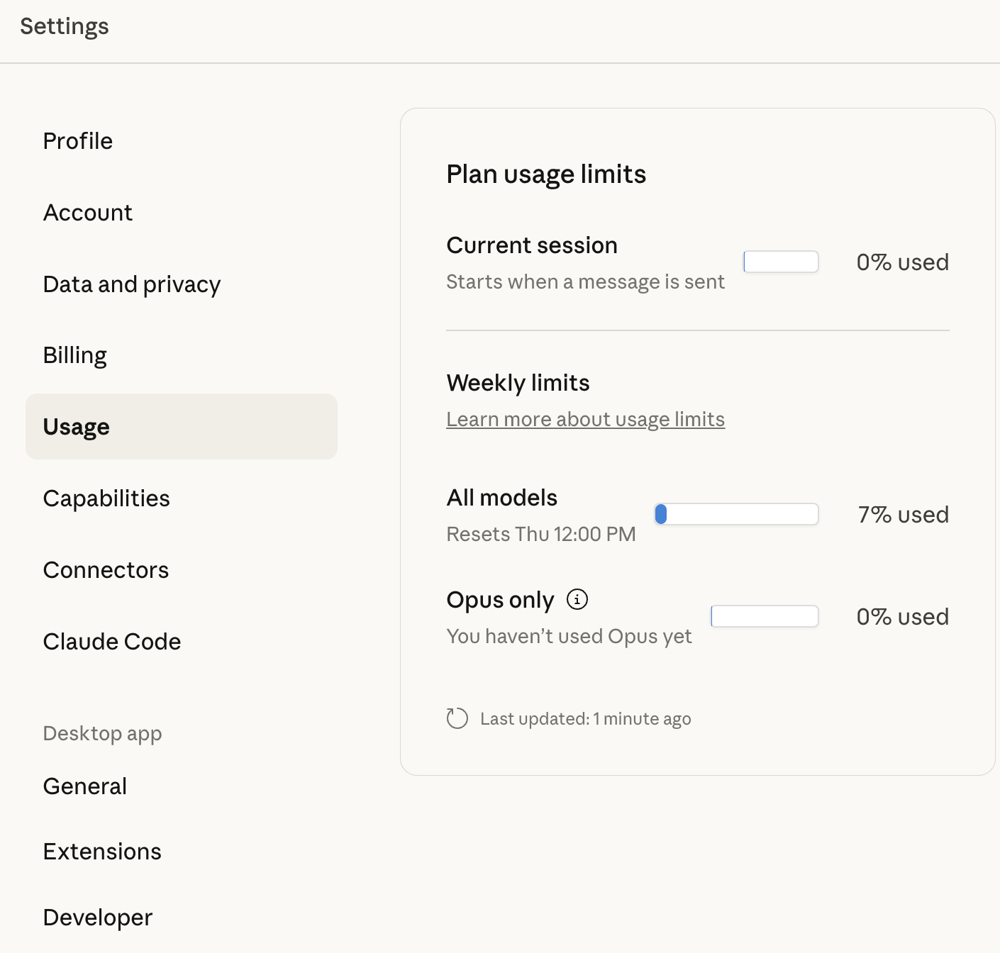

# Claude Code Custom Status Line

[](LICENSE)
[](https://github.com/howie/claude-code-omystatusline/stargazers)
[](https://github.com/howie/claude-code-omystatusline/network)
[](https://goreportcard.com/report/github.com/howie/claude-code-omystatusline)
[](https://github.com/howie/claude-code-omystatusline/releases)
[](go.mod)
[](https://github.com/howie/claude-code-omystatusline/actions/workflows/ci.yml)
[](https://github.com/howie/claude-code-omystatusline/commits/main)

> A rich, context-aware status line for Claude Code that keeps you informed about what really matters.

**📢 Version 2.1**: Major feature expansion with 10 new display sections, gradient progress bar, configurable separators, terminal capability detection, and auto-truncation to fit terminal width!

[English](#english) | [中文](#chinese)

---

<a name="english"></a>

## Why This Exists

When working with Claude Code, you're often juggling multiple concerns simultaneously:

- **"Which branch am I working on?"** - Especially critical when using git worktrees across multiple terminal sessions
- **"How much context have I consumed?"** - Token usage directly impacts response quality and cost
- **"How long have I been in this session?"** - Time tracking helps manage workflow and billing awareness

The default Claude Code interface doesn't surface this critical information. You find yourself constantly running `git branch`, checking token counts in responses, and losing track of time across multiple sessions.

**This status line solves that by bringing all essential information to every interaction.**

## Inspiration

This project was inspired by [jackle.pro's article on Claude Code status line](https://jackle.pro/articles/claude-code-status-line) and the powerful status lines in tools like:
- **Vim/Neovim** - Where the status line shows mode, file info, cursor position, and git status at a glance
- **tmux/zsh prompt** - Rich terminal status lines that display git branches, execution time, and context
- **IDE status bars** - Like VS Code's integrated git status, branch info, and diagnostic counts

The idea: *If these tools can show relevant context in every view, why can't Claude Code?*

## What Makes This Special

### 🎯 Git Intelligence
- **Branch awareness** with `⚡ main` indicator
- **Worktree detection** with `🔀` icon - crucial for parallel development
- **Smart caching** - Git operations cached for 5 seconds to avoid performance hits

**Why it matters**: When working across multiple worktrees (e.g., `feature-a` in one terminal, `hotfix` in another), you always know which branch Claude is modifying.

### 📊 Token Consumption Tracking
- **Real-time usage display**: `██████░░░░ 65% 130k`
- **Visual progress bar** showing proximity to 200k token limit
- **Color-coded warnings**:
  - 🟢 Green (< 60%): Plenty of context remaining
  - 🟡 Gold (60-80%): Moderate usage
  - 🔴 Red (≥ 80%): Approaching limit, consider starting fresh session

**Why it matters**: Token exhaustion leads to degraded responses. This visual indicator lets you proactively manage context before quality drops.

### ⏱️ Session Time Tracking
- **Accumulated time**: `2h45m` across all activities today
- **Multi-session awareness**: `[3 sessions]` when running multiple Claude instances
- **Intelligent interval tracking**: Gaps over 10 minutes create new time intervals

**Why it matters**: Helps you understand actual usage patterns, manage billing expectations, and maintain healthy work sessions.

### 🎨 At-a-Glance Context
Every status line shows (expanded mode):
```
[💠 Sonnet 4.6] 📂 my-project ⚡ main * ↑2 | ██████░░░░ 65% 130k | 2h45m [2 sessions] | 💰 $3.42 | +128/-45 | 🚀 45 t/s
⚙️ 3 tools | 🤖 2 agents | ✅ 2/5 todos | API: 42% (5h) 18% (7d)
｜Your last message appears here for context...
```

**Model** → **Git branch+status** → **Token usage** → **Time** → **Cost** → **Lines changed** → **Speed**
→ **Active tools** → **Subagents** → **Todos** → **API quota** → **Your message**

All the information you need, updated with every interaction.

## Features

- ✅ **Model Display**: Shows current Claude model (Opus 💛, Sonnet 💠, Haiku 🌸)
- ✅ **Project Info**: Current directory name for orientation
- ✅ **Git Integration**: Branch, worktree detection, dirty indicator, ahead/behind counts
- ✅ **Context Tracking**: Gradient progress bar, percentage, formatted token count
- ✅ **Session Time**: Daily accumulated time, multi-session detection
- ✅ **Cost Display**: Session cost with color thresholds (< $5 dim, ≥ $5 yellow, ≥ $10 red)
- ✅ **Lines Changed**: +N/-M lines added/removed in current session
- ✅ **Output Speed**: Real-time tokens/sec calculation
- ✅ **Active Tools**: Running tools with spinner animation and target path
- ✅ **Subagent Tracking**: Running subagents with type, model, and elapsed time
- ✅ **Todo Tracking**: In-progress todo items with progress count
- ✅ **API Limits**: 5h/7d quota display via Anthropic OAuth API
- ✅ **Autocompact Detection**: Visual indicator when context compression triggers
- ✅ **User Message**: Last message displayed for quick context recall
- ✅ **Configurable Display**: Toggle sections, choose expanded/compact mode, Powerline/Nerd Font separators
- ✅ **Terminal Detection**: Auto-detects True Color / 256-color / ASCII capabilities
- ✅ **Auto-Truncation**: Status line truncates to fit terminal width
- ✅ **Performance**: Concurrent goroutines for sub-100ms status updates
- 🔔 **Audio Notifications**: Play sounds when work needs attention (optional feature) - [Setup Guide](docs/features/audio-notifications/README.md)
- 📁 **Modular Architecture**: Clean separation of concerns with pkg/ for reusable packages

## Configuration

After installation, customize the display by editing `~/.claude/omystatusline/config.json`:

```json
{
  "display_mode": "expanded",
  "separator_style": "pipe",
  "sections": {
    "model": true,
    "git": true,
    "git_status": true,
    "context": true,
    "session": true,
    "cost": true,
    "tools": true,
    "agents": true,
    "todo": true,
    "api_limits": true,
    "speed": true,
    "session_name": true,
    "config_info": true,
    "autocompact": true,
    "user_message": true
  }
}
```

| Option | Values | Description |
|--------|--------|-------------|
| `display_mode` | `"expanded"` / `"compact"` | Multi-line expanded (default) or single-line compact |
| `separator_style` | `"pipe"` / `"powerline"` / `"nerdfont"` | Section separator style |

**Environment variable overrides:**
- `CLAUDE_STATUSLINE_ASCII=1` — Force ASCII progress bar `[####------]`
- `CLAUDE_STATUSLINE_POWERLINE=1` — Use Powerline separators
- `CLAUDE_STATUSLINE_NERDFONT=1` — Use Nerd Font separators
- `STATUSLINE_MAX_TOKENS=1000000` — Set max token limit (default: 200k)

## Installation

### Interactive Install (Recommended)

The easiest way to install with optional audio notifications:

```bash
make install
```

This will start an interactive installer with:
- 🌏 **Language Selection**: Choose English or 繁體中文 (default: English)
- ✅ **Audio Notifications**: Optional installation with three modes
  - 🔊 System default sounds (recommended)
  - 🎵 Custom audio file
  - 🗣️ Text-to-speech (TTS)
- ⚙️ **Auto Configuration**: Automatically sets up `~/.claude/settings.json`

The installer provides a friendly CLI experience in your preferred language.

### Simple Install (Status Line Only)

If you only want the status line without audio notifications:

```bash
make install-simple
```

Then manually add to your `~/.claude/settings.json`:
```json
{
  "statusLine": {
    "type": "command",
    "command": "~/.claude/omystatusline/bin/statusline-wrapper.sh",
    "padding": 0
  }
}
```

### Manual Installation

See [Installation Guide](docs/installation.md) for detailed instructions.

## Installation Directory Structure

After installation, files are organized in `~/.claude/omystatusline/`:

```
~/.claude/
├── omystatusline/                    # Main installation directory
│   ├── bin/                          # Executables
│   │   ├── statusline-go             # Status line binary
│   │   └── statusline-wrapper.sh     # Wrapper script
│   ├── scripts/                      # Helper scripts
│   │   ├── statusline.sh            # Bash implementation
│   │   └── play-notification.sh      # Audio notification script (optional)
│   └── plugins/                      # Plugin directory
│       └── voice-reminder/           # Voice reminder plugin
│           ├── bin/
│           │   └── voice-reminder    # Plugin binary
│           ├── config/
│           │   └── voice-reminder-config.json
│           ├── scripts/
│           │   ├── toggle-voice-reminder.sh
│           │   └── test-voice-reminder.sh
│           ├── data/                 # Runtime data
│           │   ├── voice-reminder-enabled
│           │   ├── voice-reminder-stats.json
│           │   └── voice-reminder-debug.log
│           └── commands/             # Slash command definitions
│               ├── voice-reminder-on.md
│               ├── voice-reminder-off.md
│               ├── voice-reminder-stats.md
│               └── voice-reminder-test.md
├── commands/                         # Symlinks to plugin commands
│   ├── voice-reminder-on.md -> ../omystatusline/plugins/voice-reminder/commands/voice-reminder-on.md
│   └── ... (other command symlinks)
└── settings.json                     # Claude Code configuration (v2.0.25+)
```

**Benefits of this structure:**
- ✅ Clear separation from Claude Code's native files
- ✅ Plugin architecture for future extensibility
- ✅ Maintains compatibility with Claude Code's slash command system via symlinks
- ✅ Easy to uninstall (just remove `~/.claude/omystatusline/`)

## How It Works

The status line receives JSON from Claude Code containing session metadata and outputs a formatted ANSI-colored string. Key optimizations:

- **Parallel processing**: Git, context, and time data fetched concurrently
- **Smart caching**: Git branch cached to reduce overhead
- **Efficient parsing**: Only reads last 100-200 lines of transcript for context analysis
- **Minimal I/O**: Fast file operations with structured JSON parsing

## Requirements

- Go 1.16+ (for recommended implementation)
- Git
- Claude Code CLI
- Terminal with ANSI color support

### Development Requirements

If you want to contribute or run linting locally:

```bash
# macOS
brew install golangci-lint

# Linux
curl -sSfL https://raw.githubusercontent.com/golangci/golangci-lint/master/install.sh | sh -s -- -b $(go env GOPATH)/bin

# Windows
go install github.com/golangci/golangci-lint/cmd/golangci-lint@latest
```

Then run:
```bash
make lint
```

## Contributing

Contributions welcome! This tool is built for the community by the community.

## License

Apache License 2.0 - customize freely!

---

<a name="chinese"></a>

## 為什麼需要這個工具

在使用 Claude Code 時，你經常需要同時關注多件事：

- **「我現在在哪個分支上工作？」** - 尤其在使用 git worktree 跨多個終端機時特別重要
- **「我已經消耗了多少 context？」** - Token 使用量直接影響回應品質和成本
- **「我在這個 session 裡工作多久了？」** - 時間追蹤有助於管理工作流程和計費意識

預設的 Claude Code 介面並不會顯示這些關鍵資訊。你會發現自己不斷地執行 `git branch`、檢查回應中的 token 數量，並在多個 session 中失去時間感。

**這個狀態列透過在每次互動中呈現所有必要資訊來解決這個問題。**

## 靈感來源

這個專案的靈感來自於 [jackle.pro 關於 Claude Code 狀態列的文章](https://jackle.pro/articles/claude-code-status-line)以及以下工具強大的狀態列：
- **Vim/Neovim** - 狀態列顯示模式、檔案資訊、游標位置和 git 狀態
- **tmux/zsh prompt** - 豐富的終端機狀態列，顯示 git 分支、執行時間和上下文
- **IDE 狀態列** - 如 VS Code 整合的 git 狀態、分支資訊和診斷計數

核心理念：*如果這些工具都能在每個視圖中顯示相關的上下文，為什麼 Claude Code 不行？*

## 特色功能

### 🎯 Git 智慧感知
- **分支感知**，顯示 `⚡ main` 指示器
- **Worktree 偵測**，使用 `🔀` 圖示 - 對平行開發至關重要
- **智慧快取** - Git 操作快取 5 秒以避免效能衝擊

**為什麼重要**：當你在多個 worktree 間工作時（例如一個終端機在 `feature-a`，另一個在 `hotfix`），你永遠知道 Claude 正在修改哪個分支。

### 📊 Token 消耗追蹤
- **即時使用量顯示**：`██████░░░░ 65% 130k`
- **視覺化進度條**，顯示接近 200k token 限制的程度
- **顏色編碼警告**：
  - 🟢 綠色（< 60%）：剩餘大量 context
  - 🟡 金色（60-80%）：中度使用
  - 🔴 紅色（≥ 80%）：接近限制，考慮開始新 session

**為什麼重要**：Token 耗盡會導致回應品質下降。這個視覺指標讓你能在品質下降前主動管理 context。

### ⏱️ Session 時間追蹤
- **累積時間**：`2h45m` 橫跨今日所有活動
- **多 Session 感知**：當執行多個 Claude 實例時顯示 `[3 sessions]`
- **智慧間隔追蹤**：超過 10 分鐘的間隔會建立新的時間區間

**為什麼重要**：幫助你了解實際使用模式、管理計費預期，並維持健康的工作 session。

### 🎨 一目了然的上下文
每個狀態列都會顯示（展開模式）：
```
[💠 Sonnet 4.6] 📂 my-project ⚡ main * ↑2 | ██████░░░░ 65% 130k | 2h45m [2 sessions] | 💰 $3.42 | +128/-45 | 🚀 45 t/s
⚙️ 3 tools | 🤖 2 agents | ✅ 2/5 todos | API: 42% (5h) 18% (7d)
｜你的最後一則訊息會顯示在這裡作為上下文...
```

**模型** → **Git 分支+狀態** → **Token 使用** → **時間** → **費用** → **行數變化** → **速度**
→ **執行中工具** → **子代理** → **待辦事項** → **API 配額** → **你的訊息**

所有你需要的資訊，隨著每次互動更新。

## 功能特色

- ✅ **模型顯示**：顯示當前 Claude 模型（Opus 💛、Sonnet 💠、Haiku 🌸）
- ✅ **專案資訊**：當前目錄名稱以便定位
- ✅ **Git 整合**：分支、worktree 偵測、髒狀態指示、超前/落後計數
- ✅ **Context 追蹤**：漸層進度條、百分比、格式化的 token 計數
- ✅ **Session 時間**：每日累積時間、多 session 偵測
- ✅ **費用顯示**：Session 費用，顏色分級（< $5 預設、≥ $5 黃色、≥ $10 紅色）
- ✅ **行數變化**：顯示本次 session 新增/刪除的程式碼行數 (+N/-M)
- ✅ **輸出速度**：即時 tokens/sec 計算
- ✅ **執行中工具**：顯示正在執行的工具及目標路徑
- ✅ **子代理追蹤**：顯示執行中子代理的類型、模型和已耗時間
- ✅ **待辦追蹤**：進行中的 todo 項目及進度計數
- ✅ **API 配額**：透過 Anthropic OAuth API 顯示 5h/7d 用量
- ✅ **自動壓縮偵測**：context 壓縮觸發時的視覺指示
- ✅ **使用者訊息**：顯示最後一則訊息以快速回憶上下文
- ✅ **可自訂顯示**：切換各區段、選擇展開/精簡模式、Powerline/Nerd Font 分隔符
- ✅ **終端偵測**：自動偵測 True Color / 256 色 / ASCII 能力
- ✅ **自動截斷**：狀態列自動截斷以符合終端寬度
- ✅ **效能**：並行 goroutine 讓狀態更新在 100ms 內完成
- 🔔 **聲音提醒**：當工作需要介入時播放提示音（選用功能）- [設定指南](docs/features/audio-notifications/README.md)

## 配置

安裝後，編輯 `~/.claude/omystatusline/config.json` 來自訂顯示內容：

```json
{
  "display_mode": "expanded",
  "separator_style": "pipe",
  "sections": {
    "model": true,
    "git": true,
    "git_status": true,
    "context": true,
    "session": true,
    "cost": true,
    "tools": true,
    "agents": true,
    "todo": true,
    "api_limits": true,
    "speed": true,
    "session_name": true,
    "config_info": true,
    "autocompact": true,
    "user_message": true
  }
}
```

| 選項 | 可選值 | 說明 |
|------|--------|------|
| `display_mode` | `"expanded"` / `"compact"` | 多行展開（預設）或單行精簡模式 |
| `separator_style` | `"pipe"` / `"powerline"` / `"nerdfont"` | 區段分隔符風格 |

**環境變數覆蓋：**
- `CLAUDE_STATUSLINE_ASCII=1` — 強制 ASCII 進度條 `[####------]`
- `CLAUDE_STATUSLINE_POWERLINE=1` — 使用 Powerline 分隔符
- `CLAUDE_STATUSLINE_NERDFONT=1` — 使用 Nerd Font 分隔符
- `STATUSLINE_MAX_TOKENS=1000000` — 設定最大 token 上限（預設：200k）

## 安裝

### 互動式安裝（推薦）

最簡單的安裝方式，可選擇性安裝音訊提醒功能：

```bash
make install
```

這會啟動互動式安裝程式，提供：
- 🌏 **語系選擇**：可選擇 English 或繁體中文（預設：English）
- ✅ **音訊提醒**：可選擇安裝，提供三種模式
  - 🔊 系統預設音效（推薦）
  - 🎵 自訂音訊檔案
  - 🗣️ 語音播報（TTS）
- ⚙️ **自動設定**：自動設定 `~/.claude/settings.json`

安裝程式提供友善的 CLI 介面，支援你偏好的語言。

### 簡單安裝（僅狀態列）

如果你只想要狀態列功能，不需要音訊提醒：

```bash
make install-simple
```

然後手動在 `~/.claude/settings.json` 中加入：
```json
{
  "statusLine": {
    "type": "command",
    "command": "~/.claude/omystatusline/bin/statusline-wrapper.sh",
    "padding": 0
  }
}
```

### 手動安裝

詳細說明請參閱[安裝指南](docs/installation.md)。

## 安裝目錄結構

安裝後，檔案會組織在 `~/.claude/omystatusline/` 目錄下：

```
~/.claude/
├── omystatusline/                    # 主安裝目錄
│   ├── bin/                          # 執行檔
│   │   ├── statusline-go             # 狀態列 binary
│   │   └── statusline-wrapper.sh     # Wrapper 腳本
│   ├── scripts/                      # 輔助腳本
│   │   ├── statusline.sh            # Bash 實作
│   │   └── play-notification.sh      # 音訊提醒腳本（選用）
│   └── plugins/                      # 插件目錄
│       └── voice-reminder/           # 語音提醒插件
│           ├── bin/
│           │   └── voice-reminder    # 插件 binary
│           ├── config/
│           │   └── voice-reminder-config.json
│           ├── scripts/
│           │   ├── toggle-voice-reminder.sh
│           │   └── test-voice-reminder.sh
│           ├── data/                 # 運行時資料
│           │   ├── voice-reminder-enabled
│           │   ├── voice-reminder-stats.json
│           │   └── voice-reminder-debug.log
│           └── commands/             # Slash command 定義
│               ├── voice-reminder-on.md
│               ├── voice-reminder-off.md
│               ├── voice-reminder-stats.md
│               └── voice-reminder-test.md
├── commands/                         # 指向插件 commands 的符號連結
│   ├── voice-reminder-on.md -> ../omystatusline/plugins/voice-reminder/commands/voice-reminder-on.md
│   └── ... (其他 command 符號連結)
└── settings.json                     # Claude Code 配置 (v2.0.25+)
```

**此結構的優點：**
- ✅ 與 Claude Code 原生檔案清楚分離
- ✅ 插件架構便於未來擴充
- ✅ 透過符號連結維持與 Claude Code slash command 系統的相容性
- ✅ 易於卸載（只需移除 `~/.claude/omystatusline/`）

## 運作原理

狀態列接收來自 Claude Code 的 JSON（包含 session 中繼資料），並輸出格式化的 ANSI 彩色字串。主要優化：

- **平行處理**：Git、context 和時間資料並行取得
- **智慧快取**：Git 分支快取以減少開銷
- **高效解析**：只讀取 transcript 最後 100-200 行進行 context 分析
- **最小化 I/O**：使用結構化 JSON 解析的快速檔案操作

## 系統需求

- Go 1.16+（建議的實作方式）
- Git
- Claude Code CLI
- 支援 ANSI 色碼的終端機

### 開發需求

如果你想要貢獻程式碼或在本地執行 linting：

```bash
# macOS
brew install golangci-lint

# Linux
curl -sSfL https://raw.githubusercontent.com/golangci/golangci-lint/master/install.sh | sh -s -- -b $(go env GOPATH)/bin

# Windows
go install github.com/golangci/golangci-lint/cmd/golangci-lint@latest
```

執行 linting：
```bash
make lint
```

## 貢獻

歡迎貢獻！這個工具是由社群為社群打造的。

## 授權

Apache License 2.0 - 歡迎自由客製化！

## 常見問題 (FAQ)

### 如何查看我的 Claude 使用狀況和重置時間？

你可以隨時在 Claude 的網頁介面查看使用狀況和重置時間：

1. 前往 [Claude.ai](https://claude.ai)
2. 點擊左側選單的 **Settings（設定）**
3. 進入 **Usage（使用狀況）** 區塊
4. 你會看到：
   - **Current session（當前 session）**：你目前活動 session 的使用量（當你發送訊息時會重置）
   - **Weekly limits（每週限制）**：
     - **All models（所有模型）**：顯示你的整體使用百分比和重置時間（例如：「Resets Thu 12:00 PM」）
     - **Opus only（僅 Opus）**：如果適用，顯示 Opus 專用的使用量



這有助於你了解何時限制會重置，並據此規劃你的 Claude Code session。

### 為什麼狀態列的 token 計數與網頁版使用百分比不一致？

狀態列顯示的是 **session 層級的 token 消耗**（你目前對話的 context，最多 200k tokens），而網頁介面顯示的是 **每週 API 使用限制**（你已使用的每週配額百分比）。這是兩種不同的指標：

- **狀態列**：追蹤當前 session 的 context window 使用量（影響回應品質）
- **網頁介面**：追蹤每週方案限制的 API 使用量（影響計費/配額）

---

## Screenshot Preview

```
[💠 Sonnet 4.6] 📂 claude-code-omystatusline ⚡ main * | 🟩🟩🟩🟨🟨░░░░░ 45% 90k | 1h23m | 💰 $2.15 | +89/-12 | 🚀 38 t/s
⚙️ 1 tool | ✅ 1/3 todos
｜Update README and release notes for v2.1.0
```

## FAQ

### How can I check my Claude usage status and reset time?

You can always check your usage status and reset time in Claude's web interface:

1. Go to [Claude.ai](https://claude.ai)
2. Click on **Settings** (left sidebar)
3. Navigate to **Usage** section
4. You'll see:
   - **Current session**: Usage for your active session (resets when you send a message)
   - **Weekly limits**:
     - **All models**: Shows your overall usage percentage and reset time (e.g., "Resets Thu 12:00 PM")
     - **Opus only**: Shows Opus-specific usage if applicable


This helps you understand when your limits will reset and plan your Claude Code sessions accordingly.

### Why doesn't my status line token count match the web usage percentage?

The status line shows **session-level token consumption** (your current conversation context, max 200k tokens), while the web interface shows **weekly API usage limits** (how much of your plan's weekly quota you've used). These are different metrics:

- **Status line**: Tracks context window usage in current session (important for response quality)
- **Web interface**: Tracks API usage against your weekly plan limits (important for billing/quota)

## Credits

Built with ❤️ for the Claude Code community.
